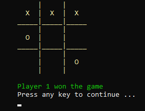

# Tic Tac Toe (C#)

## About
This is a tic tac toe game made in a C# console application.

Players take turns marking X's and O's on a 3x3 board, by typing their desired position.
- A console screen indicates which player's turn it is, and updates in real-time.
- A player wins once they match three of their X/O's in a row.

## Context
This application was made at the start Application Development I.

As an introduction to MVC, we were asked to create two Tic Tac Toe games backed by a dll model we created.

One of the games was made as a WPF application, while this one was made with C#.

I found this as the easier game to create, and serves as a good intro to MVC.

## How to run the app
1. Open the project in Visual Studio.
2. Click Run.
3. The players mark their characters by entering their desires position, with error validation in place.
    - Player 1, as X, goes first.
    - Player 2, as O, follows.

4. This continues until either a player wins, or the match ends in a draw.
5. After the game is over, the player must press any Key to start again.